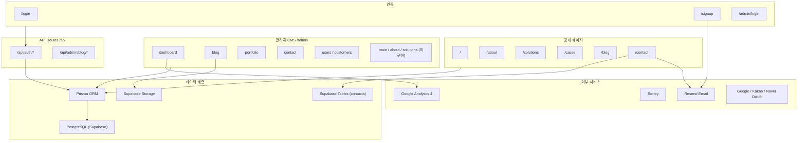

# CoreDXI-Web PRD (Product Requirements Document)

> 최종 업데이트: 2026-06-30
> 작성 기준: 코드베이스 분석 (Next.js App Router, `src/` 구조)

---

## 1. 제품 개요

**제품명**: CoreDXI 공식 기업 홈페이지 (`coredxi-web`)
**도메인**: [www.coredxi.com](https://www.coredxi.com)
**회사**: (주)코어디엑스아이 (CoreDXI)

CoreDXI는 복잡한 기업 협업을 단순화하고 AI를 통해 비즈니스 핵심을 깨우는 **AX(AI 전환) 코어 파트너**입니다. 이 홈페이지는 B2B 잠재 고객에게 회사의 솔루션·철학·성과를 전달하고, 문의 리드를 확보하는 것을 핵심 목표로 합니다. 채널톡·Loom의 디자인 철학을 참고하여 신뢰감 있고 미니멀한 톤앤매너로 설계되었습니다.

---

## 2. 목표 및 배경

| 목표 유형 | 내용 |
|-----------|------|
| **비즈니스 목표** | B2B 리드 확보(문의 전환율 향상), 브랜드 인지도 구축 |
| **마케팅 목표** | 블로그 콘텐츠 마케팅을 통한 SEO 트래픽 확보, 성공사례 노출 |
| **운영 목표** | 비개발자(홍보팀)도 콘텐츠를 자체 편집 가능한 CMS 제공 |
| **기술 목표** | Next.js 15 App Router 기반의 고성능·SEO 최적화 웹사이트 구축 |

---

## 3. 타겟 사용자

| 사용자 유형 | 설명 |
|-------------|------|
| **잠재 고객** | B2B 기업의 의사결정자(임원, 사업 담당자) — 솔루션·성공사례·문의 페이지 이용 |
| **홍보·마케팅팀** | 블로그 작성, 성공사례 등록, 메인 텍스트·이미지 수정 |
| **개발·운영팀** | 관리자 계정 관리, 고객 데이터 조회, 인프라 모니터링 |
| **일반 회원** | OAuth·이메일 가입, 특정 콘텐츠 접근 (현재 제한적) |

---

## 4. 브랜드 & 디자인 가이드라인

| 항목 | 값 |
|------|-----|
| **메인 브랜드 컬러** | 로열 블루 `#1E4E8C` (`--primary`) |
| **배경 컬러** | `#F8F9FA` (`--background`) |
| **코너 반경** | `0.75rem` 이상 (`rounded-xl`) |
| **그림자** | `shadow-sm` ~ `shadow-md` |
| **폰트** | Geist (Variable) |
| **디자인 원칙** | 미니멀리즘, 충분한 여백, 신뢰감 있는 B2B 톤 |

---

## 5. 기능 명세

### 5-1. 공개 마케팅 페이지

| 페이지 | 경로 | 주요 기능 |
|--------|------|-----------|
| 홈 | `/` | 히어로 섹션, 성공사례 미리보기(3건), 최신 블로그(5건), Mini About CTA |
| 회사 소개 | `/about` | 미션·핵심가치·KPI 수치(50+, 98%, 3배)·CTA |
| 솔루션 | `/solutions` | AI 협업 자동화·AX 컨설팅·엔터프라이즈 AI 플랫폼 3종 카드, 4단계 도입 프로세스 |
| 성공사례 목록 | `/cases` | Prisma `Portfolio` DB → 카드 그리드 |
| 성공사례 상세 | `/cases/[id]` | 썸네일·동영상 embed·본문, 동적 SEO 메타데이터 |
| 블로그 목록 | `/blog` | 발행 글 목록 + URL 검색 필터(`?q=`) |
| 블로그 상세 | `/blog/[slug]` | Tiptap/BlockNote 본문 렌더, JSON-LD |
| 블로그 카테고리 | `/blog/category/[slug]` | 카테고리별 필터링 |
| 문의하기 | `/contact` | 문의 폼(Supabase 저장) + 알림 이메일(Resend) |
| 이용약관 | `/terms` | 정적 법적 문서 |
| 개인정보처리방침 | `/privacy` | 정적 법적 문서 |

### 5-2. 인증 시스템

| 기능 | 경로 | 설명 |
|------|------|------|
| 일반 회원 로그인 | `/login` | Google·Kakao·Naver OAuth + 이메일 2단계(존재 확인 → 비밀번호) |
| 회원가입 | `/signup` | 이메일 → OTP 6자리 인증 → 이름·비밀번호 3단계 |
| 관리자 로그인 | `/admin/login` | Credentials (이메일+비밀번호) |
| 최초 설정 | `/setup` | DB에 Admin이 없을 때만 접근 가능한 초기 관리자 생성 |

**인증 라이브러리**: NextAuth v5 (Auth.js)
**보호 경로**: `src/middleware.ts` — `/admin/*` 경로는 `SUPER_ADMIN` 또는 `EDITOR` Role만 접근 허용

### 5-3. 관리자 CMS 패널 (`/admin`)

| 메뉴 | 경로 | 상태 | 기능 |
|------|------|------|------|
| 대시보드 | `/admin/dashboard` | ✅ 완료 | 통계 카드(블로그·문의·포트폴리오·회원 수), GA4 분석, 퀵액션, 활동 로그 |
| 홈 페이지 편집 | `/admin/main` | ⬜ 플레이스홀더 | 히어로 섹션 CMS (미구현) |
| 회사소개 편집 | `/admin/about` | ⬜ 플레이스홀더 | About 페이지 CMS (미구현) |
| 솔루션 편집 | `/admin/solutions` | ⬜ 플레이스홀더 | Solutions 페이지 CMS (미구현) |
| 성공사례 관리 | `/admin/portfolio` | ✅ 완료 | 목록·신규 등록·수정·삭제 |
| 블로그 관리 | `/admin/blog` | ✅ 완료 | 글 목록·신규 작성(Tiptap 에디터)·수정·발행 |
| 블로그 주제 관리 | `/admin/blog/topics` | ✅ 완료 | 카테고리 CRUD |
| 문의 관리 | `/admin/contact` | ✅ 완료 | 문의 목록·상태 변경·알림 이메일 설정 |
| 관리자 계정 | `/admin/users` | ✅ 완료 | 관리자 목록·Role 변경(SUPER_ADMIN/EDITOR/VIEWER) |
| 관리자 등록 | `/admin/register` | ✅ 완료 | 새 관리자 생성 |
| 고객 관리 | `/admin/customers` | ✅ 완료 | 일반 회원 목록·상세·수정·삭제 |
| 설정 | `/admin/settings` | ✅ 완료 | 계정 관리 메뉴 허브 |

### 5-4. API Routes

| 엔드포인트 | 메서드 | 용도 |
|------------|--------|------|
| `/api/auth/[...nextauth]` | GET, POST | NextAuth 핸들러 |
| `/api/auth/health` | GET | OAuth/DB 환경변수 진단 |
| `/api/auth/check-email` | POST | 이메일 존재·비밀번호 유무 확인 |
| `/api/auth/send-otp` | POST | 회원가입 OTP 발송 (Resend, 60초 쿨다운) |
| `/api/auth/verify-otp` | POST | OTP 검증 (5분 만료) |
| `/api/auth/register` | POST | 이메일 회원가입 (bcrypt → Prisma) |
| `/api/auth/reset` | GET | 잘못된 NextAuth 쿠키 삭제 |
| `/api/admin/blog/upload-image` | POST | 블로그 이미지 업로드 → Supabase Storage |
| `/api/admin/blog/import-image` | POST | 외부 이미지 URL → Supabase (CORS 회피, SSRF 방지) |

### 5-5. SEO & 메타데이터

- 루트 `layout.tsx`에 전역 `metadata` (title, description, openGraph, robots)
- 동적 페이지(`/cases/[id]`, `/blog/[slug]`)에 `generateMetadata()` 적용
- `opengraph-image.tsx` (루트·블로그·성공사례별)
- `sitemap.ts`, `robots.ts` 자동 생성
- 블로그 글 상세에 JSON-LD (Article) 삽입
- 루트 `layout.tsx`에 Organization JSON-LD
- 네이버 서치어드바이저 메타태그 포함

---

## 6. 기술 아키텍처

### 6-1. 기술 스택

| 레이어 | 기술 | 버전 |
|--------|------|------|
| 프레임워크 | Next.js (App Router) | 15.5.x |
| UI 라이브러리 | React | 19.x |
| 언어 | TypeScript | 5.x |
| 스타일링 | Tailwind CSS (CSS 기반 설정) | v4 |
| UI 컴포넌트 | shadcn/ui (base-nova 스타일) | 최신 |
| ORM | Prisma | 7.x |
| 데이터베이스 | PostgreSQL (Supabase 호스팅) | - |
| 스토리지 | Supabase Storage (`blog-images` 버킷) | - |
| 인증 | NextAuth v5 (Auth.js) | 5.0.0-beta.31 |
| 에디터 | Tiptap (WYSIWYG) + BlockNote (레거시 호환) | 3.13.0 |
| 이메일 | Resend | - |
| 모니터링 | Sentry | - |
| 분석 | Google Analytics 4 (Data API) | - |
| 패키지 매니저 | pnpm + Turbopack | - |
| 배포 | Vercel | - |

### 6-2. 데이터베이스 스키마 (Prisma)

| 모델 | 용도 |
|------|------|
| `Admin` | 관리자 (이메일·비밀번호·Role: SUPER_ADMIN/EDITOR/VIEWER) |
| `User` | 일반 회원 (NextAuth) |
| `Account`, `Session`, `VerificationToken` | NextAuth 어댑터 |
| `OtpCode` | 회원가입 이메일 OTP |
| `Portfolio` | 성공사례 CMS |
| `BlogPost` | 블로그 글 (Tiptap JSON 본문) |
| `BlogCategory` | 블로그 카테고리 |

**Supabase 테이블** (Prisma 외):

| 테이블 | 용도 |
|--------|------|
| `contacts` | 문의 접수·상태 관리 |
| `contact_settings` | 알림 이메일 설정 (`notification_email` 키) |

### 6-3. 아키텍처 다이어그램



### 6-4. 프로젝트 디렉터리 구조

```
src/
├── app/                    # Next.js App Router (87개 파일)
│   ├── (공개 페이지)        # /, /about, /solutions, /cases, /blog, /contact, ...
│   ├── admin/              # 관리자 패널 (/admin/*)
│   ├── api/                # API Routes
│   ├── layout.tsx          # 루트 레이아웃
│   ├── globals.css         # Tailwind v4 + 테마 설정
│   ├── sitemap.ts
│   └── robots.ts
├── components/             # UI 컴포넌트 (46개 파일)
│   ├── Header.tsx, Hero.tsx, Footer.tsx, Logo.tsx
│   ├── CasesPreview.tsx
│   ├── cases/, blog/, login/, editor/
│   ├── admin/dashboard/    # 관리자 대시보드 컴포넌트
│   └── ui/                 # shadcn/ui 컴포넌트
├── lib/                    # 유틸·서비스 레이어 (30개 파일)
│   ├── prisma.ts, utils.ts
│   ├── supabase/admin.ts
│   ├── auth/, ga4/
│   └── blog-image-storage.ts, resend.ts, seo.ts, ...
├── actions/                # Server Actions
│   ├── contact.ts
│   └── sendEmail.ts
├── auth.ts, auth.config.ts # NextAuth 설정
├── middleware.ts            # 관리자 라우트 보호
└── types/                  # TypeScript 타입 확장
```

---

## 7. 외부 서비스 연동

| 서비스 | 용도 | 환경변수 |
|--------|------|----------|
| **Supabase** | PostgreSQL DB + Storage + contacts 테이블 | `NEXT_PUBLIC_SUPABASE_URL`, `SUPABASE_SERVICE_ROLE_KEY` |
| **Google OAuth** | 소셜 로그인 | `GOOGLE_CLIENT_ID`, `GOOGLE_CLIENT_SECRET` |
| **Kakao OAuth** | 소셜 로그인 | `KAKAO_CLIENT_ID`, `KAKAO_CLIENT_SECRET` |
| **Naver OAuth** | 소셜 로그인 | `NAVER_CLIENT_ID`, `NAVER_CLIENT_SECRET` |
| **Resend** | 이메일 발송 (OTP, 문의 알림) | `RESEND_API_KEY` |
| **Google Analytics 4** | 방문자 분석 + 관리자 대시보드 | `NEXT_PUBLIC_GA_MEASUREMENT_ID`, `GA4_PROPERTY_ID`, `GA4_SERVICE_ACCOUNT_JSON` |
| **Sentry** | 에러 모니터링 | (next.config.ts에서 org/project 설정) |
| **Notion** | (환경변수 존재, 실제 연동 미확인) | `NOTION_TOKEN`, `NOTION_*_DB_ID` (7개) |
| **Vercel** | 배포 플랫폼 | `.vercel/project.json` |

---

## 8. 배포 환경

- **플랫폼**: Vercel
- **프로덕션 도메인**: `www.coredxi.com`
- **리다이렉트**: `coredxi.com/*` → `www.coredxi.com/*` (301 영구)
- **개발 서버**: `pnpm dev` → 포트 3100 (Turbopack)
- **빌드**: `prisma generate && next build`
- **postinstall**: `prisma generate` (Vercel 배포 시 자동 실행)

---

## 9. 비기능 요구사항

| 항목 | 내용 |
|------|------|
| **SEO** | 정적·동적 메타데이터, sitemap, robots, JSON-LD, OG 이미지 |
| **성능** | Turbopack 개발 빌드, `force-dynamic`은 홈(`/`)에만 적용, 이미지 최적화 |
| **보안** | 관리자 미들웨어 Role 체크, SSRF 방지(이미지 import), bcrypt 비밀번호 해시 |
| **접근성** | shadcn/ui 컴포넌트 기반 (WAI-ARIA 준수) |
| **반응형** | 모바일·태블릿·데스크탑 전 해상도 지원 |
| **유지보수** | 비개발자용 `CONTENT_GUIDE.md` 제공, 코드 내 `[홍보팀]` 한국어 주석 |

---

## 10. 용어 정의

| 용어 | 설명 |
|------|------|
| **AX** | AI 전환(AI Transformation) — CoreDXI의 핵심 사업 영역 |
| **Portfolio** | 코드베이스 내 성공사례 모델명 (공개 표시명: "성공사례") |
| **SUPER_ADMIN** | 모든 관리자 기능 접근 가능한 최고 권한 |
| **EDITOR** | 블로그·포트폴리오 편집 권한 |
| **VIEWER** | 조회 전용 권한 |
| **Tiptap** | 블로그 에디터로 사용하는 WYSIWYG 라이브러리 |
| **BlockNote** | 이전 버전 블로그 글 호환을 위한 레거시 에디터 |
